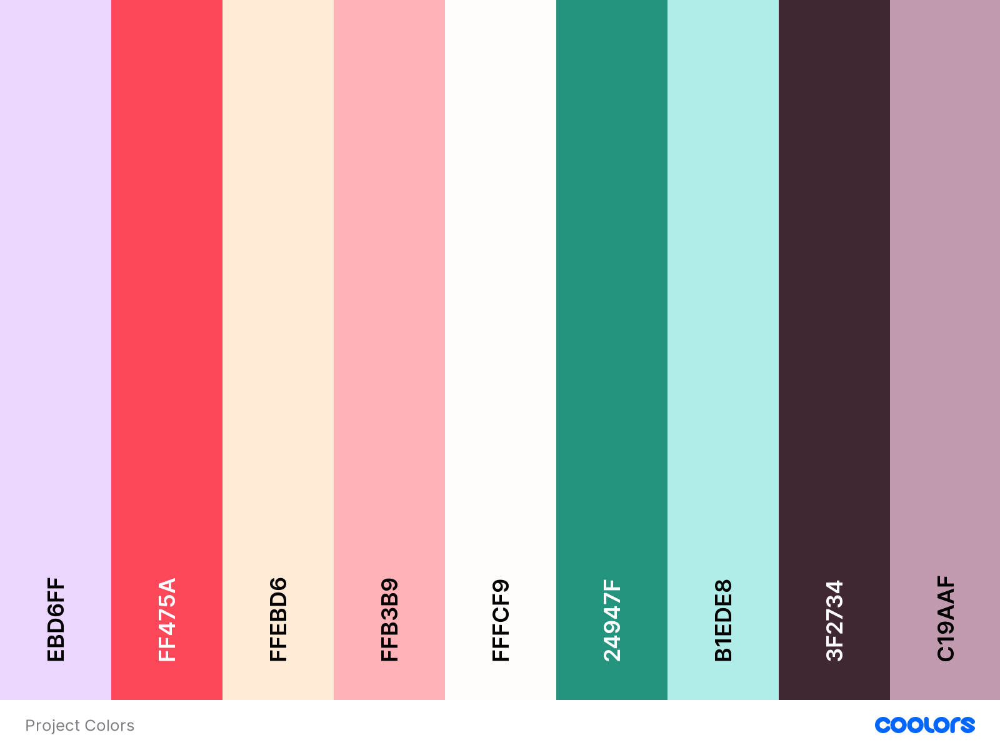
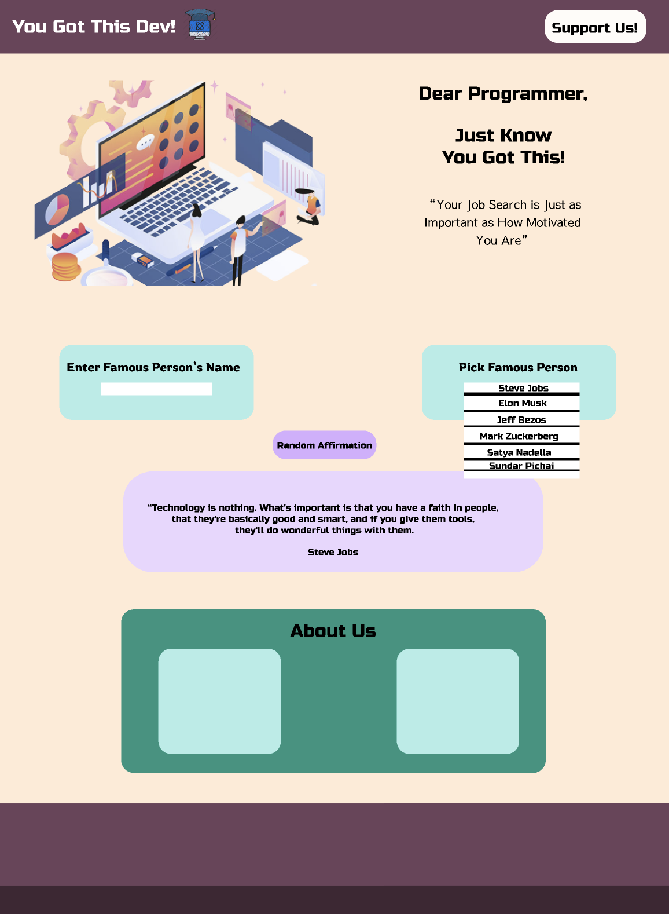

# 

[ You Got This Dev](http://github.com/George-Sucuzhanay) is a fully functional web app with the utilization of public api's. It was designed by our team as part of our Phase 1 Group Project. We built it during the 2021-2022 Full-Stack Progressive Web Development Bootcamp at The Knowledge House. 

## You Got This Dev, is a motivational web app with targeted to aspiring developers in their search for their first tech gig

With the newly redesigned app, use the interactive and intuitive interface to easily browse through a randomize collection of famous quotes from tech leaders. Keeps your job search in check and remember to work hardas you follow our affirmations.

#### Feel tired and depressed by the rejection letters from employers?

- Learn the best advice from the tech leaders in the industry
- Get an affrimation assuring you that job!
- Get targetted quotes from famous people you know

## Color Guide

## Wireframes

#### Mobile

#### Desktop

## 👩🏽‍🚀 Feature List

Features of You Got This Dev include:
- Search by Famous Author feature
- Randomized famous motivational quote feature
- Randomized affrimations feature

### 🚀 MVP

- API's Used:
    - Dictum API
    - Affirmations API
- Wishlist functionality:
  - Implement the Job Search API to work inconjuction with our web app
- Search functionality
  - Includes a recommended search query based on user's input

### Project Requirements:
* Be built with HTML, CSS , and Javascript.
* Use Axios to retrieve data from an external source, and render such data into the DOM.
* Use flexbox, or Grid, No Bootstrap (You can use other CSS frameworks).
* Implement responsive design on 3 screen sizes, desktop, tablet and mobile using media queries.
* Host on either Netlify or Surge.
* If your API requires the use of an API Key, an ENV file is required.
* In regards to the API, the project must show at least 3 different API uses/endpoints, for example: Giphy: Search, Trending, and Random Gif's.

### Axios with Fetch API

Pros of this model: 

Cons of this model: 

### 🌟 Post-MVP:

### 🗒️ Component Hierarchy:

### 📦 Dependencies:

FrontEnd:

- Axios
- HTML
- CSS

Backend:

- JavaScript
- Netlify

## You Got This Dev! team:

| George Sucuzhanay                                                                                                                                                                   
| --------------------------------------------------------------------------------------------------------------------------------------------------------------------------------- |
|   |
|                                                                                                                                                                                   |

